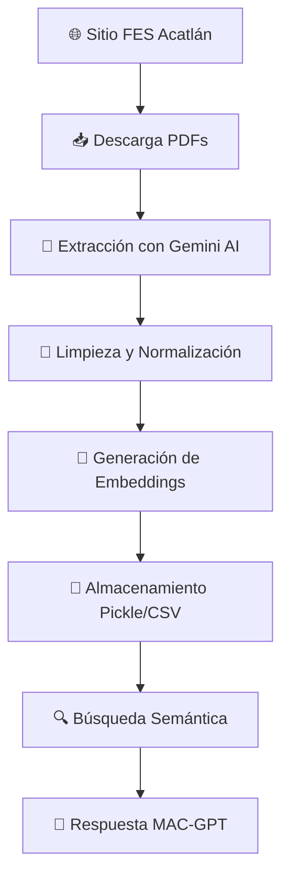

# 🤖 MAC-GPT


**MAC-GPT** es un asistente virtual inteligente especializado en la **Licenciatura en Matemáticas Aplicadas y Computación** de la FES Acatlán, UNAM. Utiliza tecnología RAG (Retrieval-Augmented Generation) con Google Gemini AI para proporcionar información precisa y actualizada sobre el programa académico.

## ✨ Características Principales

- 🧠 **Sistema RAG Inteligente**: Combina búsqueda semántica con generación de respuestas
- 📚 **Extracción Automatizada**: Pipeline ETL que procesa PDFs de temarios oficiales
- 💬 **Interfaz Moderna**: Web app estilo ChatGPT con modo claro/oscuro
- 🔍 **Búsqueda Semántica**: Utiliza embeddings vectoriales para recuperación contextual
- 📱 **Múltiples Interfaces**: CLI, Web, y API programática
- 🔄 **Datos Actualizados**: Extracción automática desde fuentes oficiales

## 🏗️ Arquitectura del Sistema

```
MAC-GPT/
├── 🔧 config/                 # Configuraciones del sistema
│   ├── __init__.py
│   └── settings.py
├── 📊 data/                   # Datos y archivos procesados
│   ├── pdfs/                  # PDFs de temarios por semestre
│   ├── pickles/               # Datos con embeddings
│   └── output/                # Archivos de salida procesados
├── 🧠 src/                    # Código fuente principal
│   ├── chatbot/               # Sistema de chatbot MAC-GPT
│   │   ├── mac_gpt.py         # Motor RAG principal
│   │   ├── cli.py             # Interfaz línea de comandos
│   │   ├── web/               # Aplicación web Flask
│   │   └── ejemplo_uso.py     # Documentación por código
│   ├── extractors/            # Extracción de datos
│   │   ├── web_scraper.py     # Selenium para PDFs
│   │   └── pdf_extractor.py   # Procesamiento con Gemini AI
│   ├── transformers/          # Procesamiento y embeddings
│   │   └── embeddings.py      # Generación de vectores
│   └── loaders/               # Persistencia de datos
│       └── file_handler.py    # Manejo de archivos
├── ⚙️ pipeline/               # Pipeline ETL
│   ├── extract.py             # Fase de extracción
│   └── transform.py           # Fase de transformación
├── 🚀 main.py                 # Punto de entrada principal
└── 📋 requirements.txt        # Dependencias
```

## 🚀 Inicio Rápido

### Prerrequisitos

- 🐍 **Python 3.8+** instalado
- 🔑 **API Key de Google Gemini** ([Obtener aquí](https://makersuite.google.com/app/apikey))
- 🌐 **Chrome/Chromium** (para web scraping)

### 📦 Instalación

1. **Clonar el repositorio**
   ```bash
   git clone https://github.com/tu-usuario/MAC-GPT.git
   cd MAC-GPT
   ```

2. **Crear entorno virtual**
   ```bash
   python -m venv env
   source env/bin/activate  # Windows: env\Scripts\activate
   ```

3. **Instalar dependencias**
   ```bash
   pip install -r requirements.txt
   ```

4. **Configurar variables de entorno**
   ```bash
   cp .env.example .env
   ```
   Edita `.env` y agrega tu API Key:
   ```env
   GEMINI_API_KEY=tu_api_key_aquí
   FLASK_SECRET_KEY=tu_clave_secreta_flask
   FLASK_ENV=development
   ```

### 🎯 Uso Básico

#### 💬 Chatbot Web (Recomendado)
```bash
python main.py --web
```
Abre tu navegador en `http://localhost:5000`

#### 🖥️ Chatbot CLI
```bash
python main.py --chatbot
```

#### 🔄 Pipeline ETL Completo
```bash
python main.py
```

## 📖 Documentación Avanzada

### 🔧 Opciones de Configuración

#### Pipeline ETL
```bash
python main.py [opciones]

Opciones disponibles:
  --skip-download     Omitir descarga de PDFs
  --skip-extraction   Omitir extracción de datos
  --skip-embeddings   No generar embeddings
  --pdf-dir PATH      Directorio de PDFs personalizado
  --output-name NAME  Nombre base para archivos de salida
```

#### Interfaz Web
```bash
python main.py --web [opciones]

Opciones disponibles:
  --port PORT         Puerto del servidor (default: 5000)
  --debug             Modo de desarrollo con hot-reload
```

### 🛠️ Uso Programático

```python
from src.chatbot import configure_google_api, ask_mac_gpt

# Configurar la API
configure_google_api("TU_API_KEY")

# Realizar consultas
respuesta = ask_mac_gpt("¿Cuáles son las áreas de especialización de MAC?")
print(respuesta)
```

### 🔄 Ejecución por Módulos

#### Solo Extracción
```bash
python -m pipeline.extract --pdf-dir data/pdfs --output-name mis_datos
```

#### Solo Transformación
```bash
python -m pipeline.transform --input-file data/pickles/mis_datos.pkl
```

#### Chatbot Directo
```bash
python -m src.chatbot.cli
python -m src.chatbot.web.run
```

## 🔄 Flujo de Datos



### 🏗️ Componentes del Sistema

| Fase | Tecnología | Descripción |
|------|------------|-------------|
| **🕷️ Extracción** | Selenium + Gemini AI | Descarga PDFs y extrae información estructurada |
| **🔄 Transformación** | pandas + numpy | Limpieza, normalización y embeddings vectoriales |
| **💾 Almacenamiento** | Pickle + CSV | Persistencia optimizada para RAG |
| **🧠 RAG System** | Google Gemini | Clasificación, recuperación y generación |
| **🌐 Interfaz** | Flask + JavaScript | Web app moderna y responsive |

## 🚀 Deployment

### Para Desarrollo Local
```bash
python main.py --web --debug
```

### Para Producción
```bash
# Configurar variables de entorno de producción
export FLASK_ENV=production
export GEMINI_API_KEY=tu_api_key

# Ejecutar servidor
python main.py --web --port 8000
```

### Deploy en Railway/Render/Heroku
1. Fork este repositorio
2. Conecta tu cuenta de hosting
3. Configura variables de entorno
4. Deploy automático 🚀

## 🤝 Contribuir

1. 🍴 Fork el proyecto
2. 🌿 Crear una rama: `git checkout -b feature/nueva-funcionalidad`
3. 💾 Commit cambios: `git commit -m 'Agregar nueva funcionalidad'`
4. 📤 Push a la rama: `git push origin feature/nueva-funcionalidad`
5. 🔀 Abrir Pull Request

## 📋 Roadmap

- [ ] 🗃️ Integración con base de datos PostgreSQL
- [ ] 📊 Dashboard de administración
- [ ] 🔔 Sistema de notificaciones
- [ ] 📱 App móvil Progressive Web App
- [ ] 🌍 Multiidioma (inglés)
- [ ] 🧪 Tests automatizados completos

## 🆘 Soporte

- 📧 **Email**: [tu-email@example.com](mailto:tu-email@example.com)
- 🐛 **Issues**: [GitHub Issues](https://github.com/tu-usuario/MAC-GPT/issues)
- 📖 **Wiki**: [Documentación completa](https://github.com/tu-usuario/MAC-GPT/wiki)

## 📄 Licencia

Este proyecto está bajo la Licencia MIT - ver el archivo [LICENSE](LICENSE) para más detalles.

---

<div align="center">

**⭐ Si este proyecto te fue útil, ¡no olvides darle una estrella! ⭐**

Desarrollado con ❤️ para la comunidad académica de la FES Acatlán

</div> 